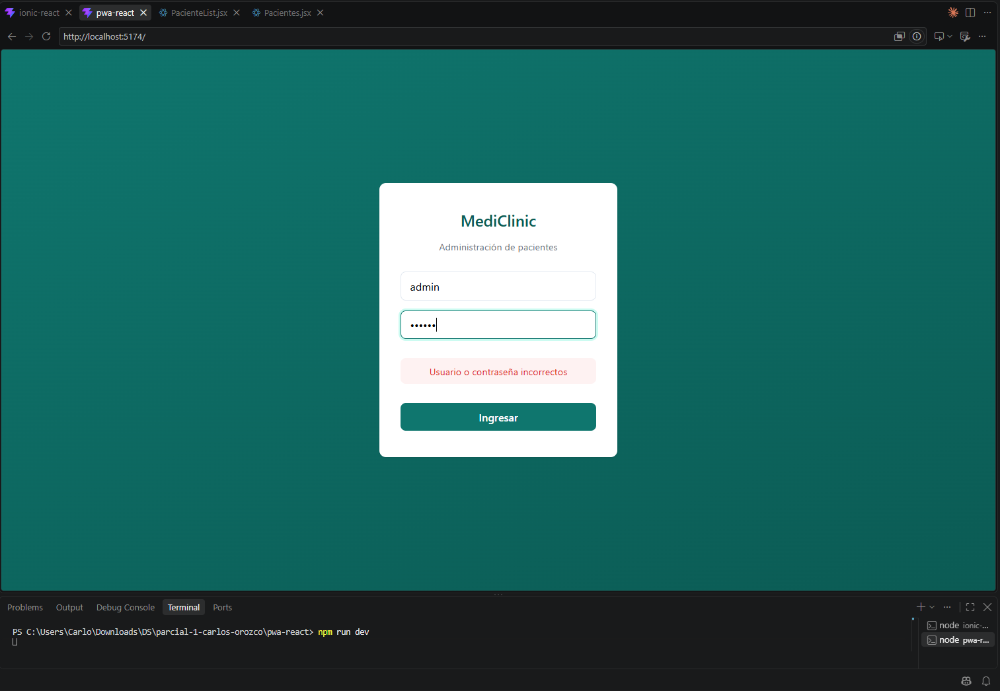
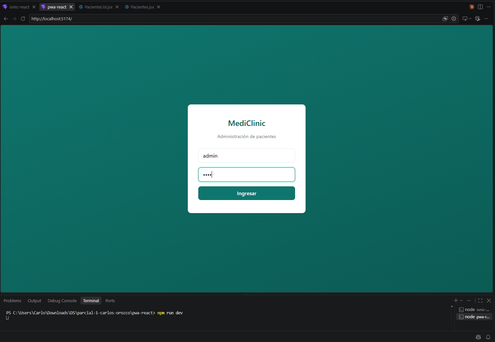
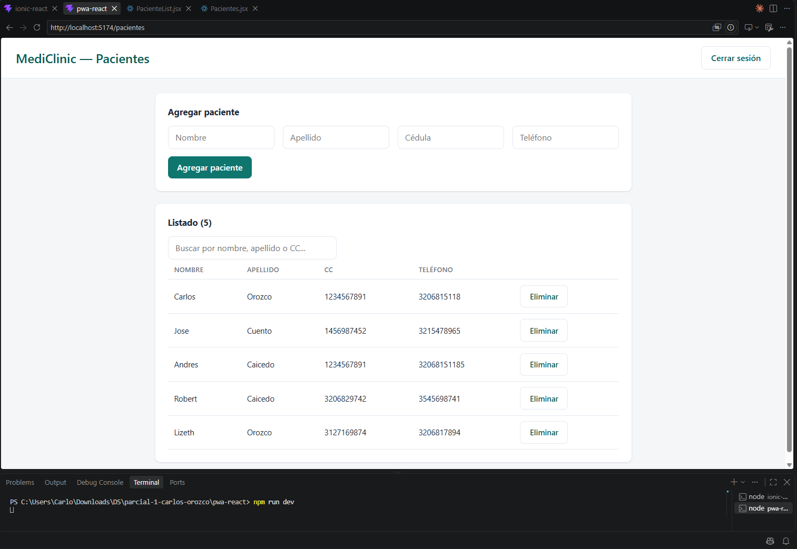
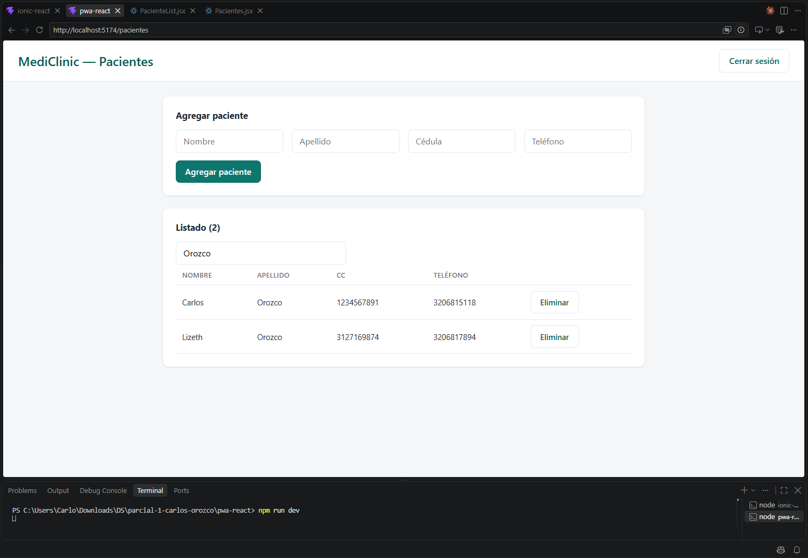
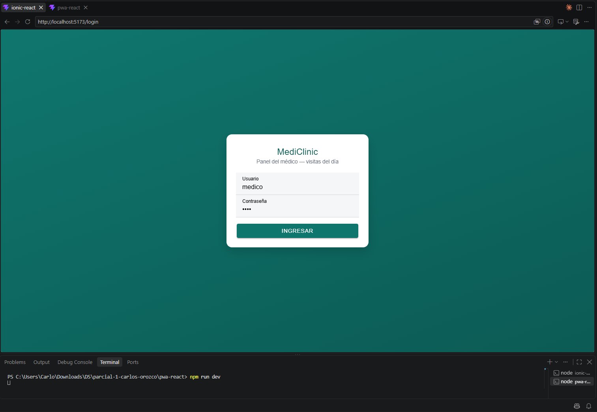
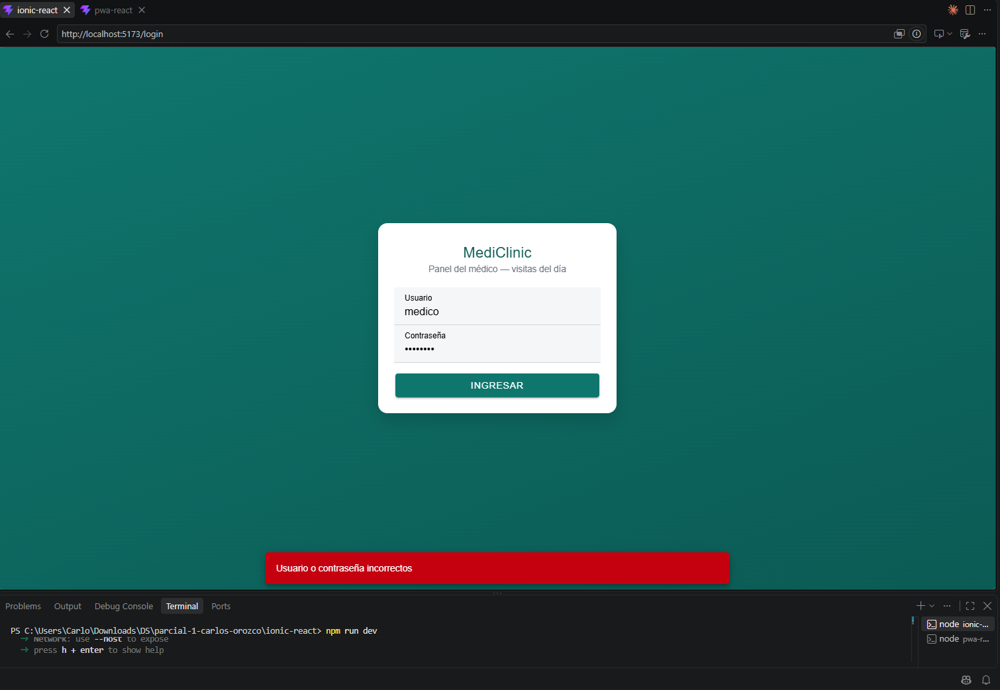
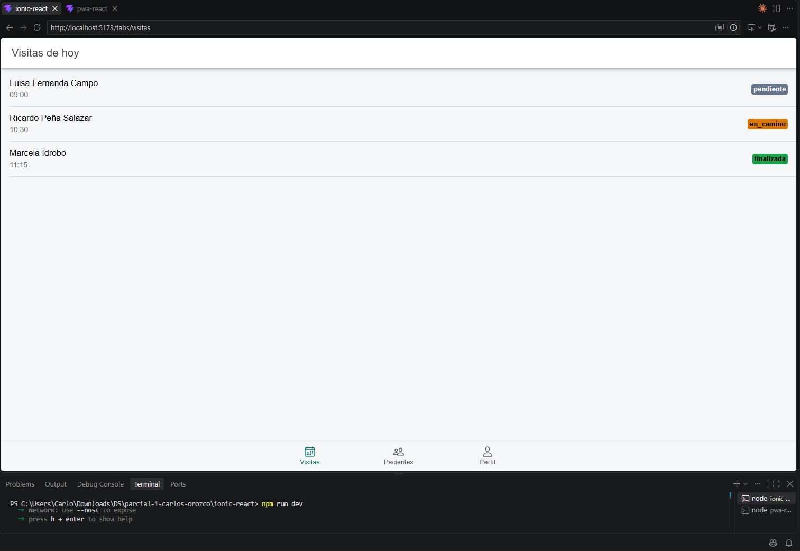
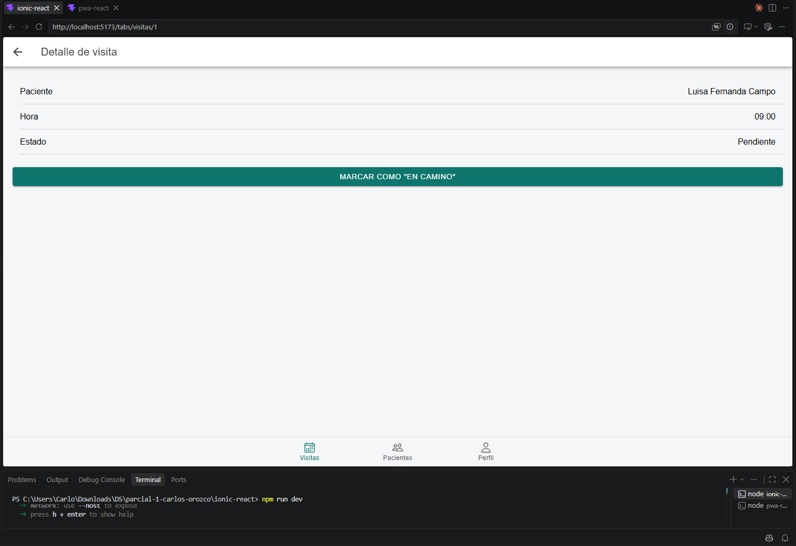
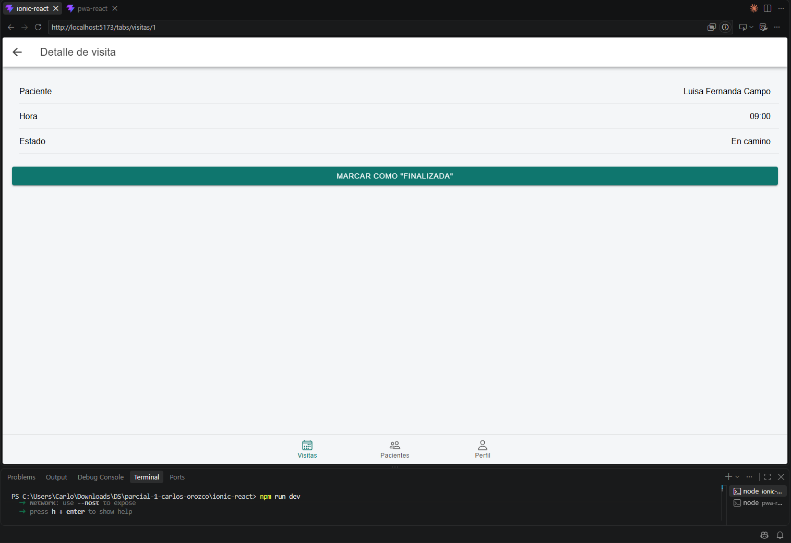

<div align="center">

# Parcial 1 — Desarrollo de Plataformas Móviles

**MediClinic** · Carlos Orozco


</div>

---

Dos aplicaciones **independientes** para la clínica MediClinic: una PWA en React para administrar pacientes, y una app Ionic con navegación por pestañas para que un médico consulte y actualice sus visitas del día.

Ninguna usa backend — toda la persistencia se maneja con `localStorage` — y no comparten información entre sí: cada una guarda sus datos bajo sus propias claves y corre en un puerto distinto.

| | Parte 1 | Parte 2 |
|---|---|---|
| **App** | PWA React | Ionic React |
| **Carpeta** | `PWA-React/` | `Ionic-React/` |
| **Propósito** | Administrar pacientes | Consultar visitas del médico |
| **Stack** | Vite + React + `vite-plugin-pwa` | Vite + `@ionic/react` |
| **Credenciales** | `admin` / `1234` · `doctor` / `clinica2024` | `medico` / `1234` |

## Contenido

- [Estructura del repositorio](#estructura-del-repositorio)
- [Parte 1 — PWA React](#parte-1--pwa-react-administración-de-pacientes)
- [Parte 2 — Ionic React](#parte-2--ionic-react-visitas-del-médico)
- [Condiciones del enunciado](#condiciones-del-enunciado)

Cada parte trae sus propias capturas en la sección "Capturas" correspondiente.

## Estructura del repositorio

```text
parcial-1-carlos-orozco/
├── PWA-React/          → Parte 1 — Administración de pacientes
├── Ionic-React/        → Parte 2 — Visitas del médico
├── capturas/
│   ├── pwa-react/      → Evidencia de Parte 1 funcionando
│   └── ionic-react/    → Evidencia de Parte 2 funcionando
└── README.md
```

---

## Parte 1 — PWA React (Administración de pacientes)

Aplicación web progresiva construida con **Vite + React** y `vite-plugin-pwa`.

### Funcionalidades

- **Login** con usuarios fijos. Al validar correctamente, la sesión se guarda en `localStorage` y se recupera automáticamente al recargar la página. Incluye botón de cerrar sesión y mensaje de error visible cuando las credenciales no coinciden.
- **Gestión de pacientes**: formulario para registrar nombre, apellido, cédula y teléfono, con validación de campos obligatorios y de formato (cédula y teléfono deben ser numéricos, entre 6 y 10 dígitos). Los pacientes quedan persistidos en `localStorage` y se pueden eliminar desde el listado.
- **Búsqueda**: filtra por nombre, apellido o cédula. El estado del término de búsqueda vive en el componente padre (`Pacientes.jsx`) y la lista ya filtrada se pasa como prop al componente hijo encargado de mostrarla.

### Credenciales

| Usuario  | Contraseña    |
|----------|---------------|
| `admin`  | `1234`        |
| `doctor` | `clinica2024` |

### Cómo correrla

```bash
cd PWA-React
npm install
npm run dev
```

### Capturas

| Login — credenciales incorrectas | Login — a punto de entrar |
|---|---|
|  |  |

| Listado de pacientes | Búsqueda filtrando |
|---|---|
|  |  |

---

## Parte 2 — Ionic React (Visitas del médico)

Aplicación móvil construida con **Vite + `@ionic/react`** (React Router v6), con navegación por pestañas.

### Funcionalidades

- **Login** con componentes de Ionic (`IonInput`, `IonButton`). Si las credenciales son incorrectas se muestra un `IonToast`. La sesión válida se guarda en `localStorage`.
- **Navegación por tabs**: tras iniciar sesión, `IonTabs` presenta tres secciones — Visitas, Pacientes y Perfil.
- **Visitas del día**: lista con paciente, hora y estado de cada visita. Al seleccionar una, se navega a su detalle, donde el estado avanza en orden `pendiente → en_camino → finalizada`. Los cambios quedan guardados en `localStorage`.
- **Perfil**: muestra el usuario autenticado y permite cerrar sesión.

### Credenciales

| Usuario  | Contraseña |
|----------|------------|
| `medico` | `1234`     |

### Cómo correrla

```bash
cd Ionic-React
npm install
npm run dev
```

### Capturas

| Login | Login — credenciales incorrectas |
|---|---|
|  |  |

| Tabs — visitas del día |
|---|
|  |

| Detalle — pendiente | Detalle — en camino |
|---|---|
|  |  |

---

## Condiciones del enunciado

- Ninguna de las dos aplicaciones usa backend; toda la persistencia se hace con `localStorage`.
- Las aplicaciones no comparten información entre sí: cada una guarda sus datos bajo claves de `localStorage` distintas y corre en un puerto distinto durante el desarrollo.
